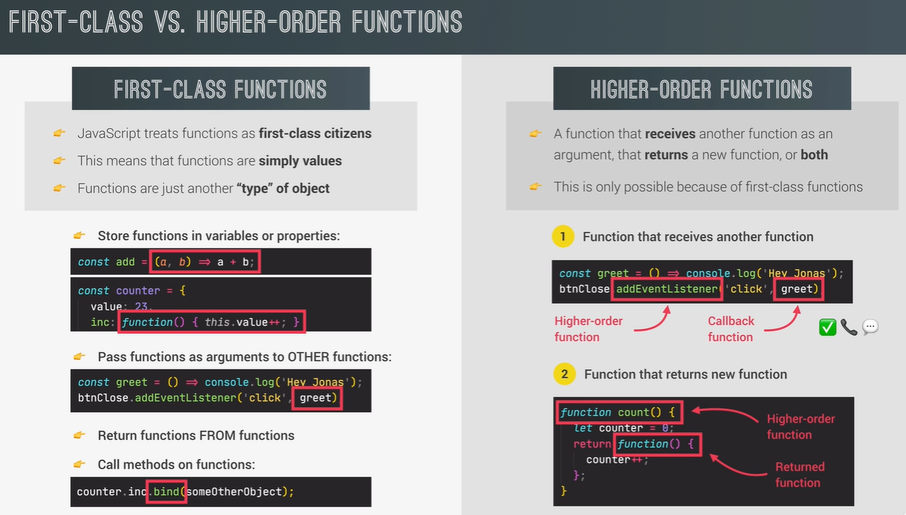

# First-Class and Higher-Order Functions

## - JS has First-Class functions that enables us to write Higher-Order functions. But what does this mean?

## - What does JS having 'First-Class Functions' mean?

## - It just means that functions are a different 'type' of object in JS. Since objects are values, functions are values too. And since functions are values, they can be stored in variables or even object properties (keys in an object). We have already been doing this so far.

## - We can also pass functions as args to other functions. We already did that with `addEvenListener` where we passed in the callback function as an argument .

## - We can also return a function from another function.

## - Finally, since functions are objects, and objects can have methods on them, there can also be function methods. bind method is an example of that.

## - What is a Higher-Order Function then?

## - A Higher-Order function is either a function that receives a function as an argument, or returns a new function, or both.

## - `addEventListener` is an example of a higher-order function because it accepts another function as an arg.

## - Similarly we can have functions that return other functions.

<!-- add an image -->

## - Let's look at an example of a function that returns a function:

```js
const greet = function (greeting) {
  return function (name) {
    console.log(`${greeting} ${name}`);
  };
};

const greeterHey = greet("Hey");
greeterHey("Jonas");
greeterHey("Steven");

greet("Hello")("Jonas");
```

## - So what is happening here?

## - We are calling the `greet` function and passing in the string `"Hey"` as an argument. This returns a new function that is stored in the `greeterHey` variable.

## - Then we call the `greeterHey` function and pass in the string `"Jonas"` as an argument. This prints out `"Hey Jonas"`.

## - We can also do this in one line:

```js
greet("Hello")("Jonas");
```

## - This is the same as:

```js
const greetHello = greet("Hello");
greetHello("Jonas");
```

## - So what is the point of this?

## - This is useful when we want to create a function that is going to be used in multiple places, but we want to customize it a little bit.

## - For example, let's say we want to create a function that is going to be used to greet people in different languages. We can do this:

```js
const greetEnglish = greet("Hello");
const greetSpanish = greet("Hola");
const greetGerman = greet("Hallo");

greetEnglish("Jonas");
greetSpanish("Jonas");
greetGerman("Jonas");
```

## - This is a lot more efficient than writing out the entire function every time we want to greet someone in a different language.


